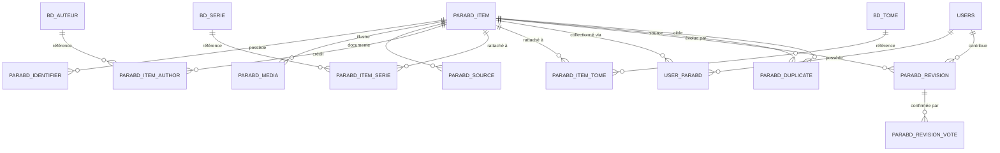

# Para-BD - spécification fonctionnelle et technique

- Statut : version 0.2, MVP implémenté derrière un drapeau désactivé par défaut
- Périmètre initial : statuettes/figurines et ex-libris/tirés à part
- Objectif : tester un catalogue communautaire sans créer une nouvelle file de validation administrative

Implémentation de référence : migration `sql/2026-08-09-create-parabd.sql`, contrôleurs
`Parabd`, `Adminparabd`, actions `Macollection/Parabd` et `Guest/Parabd`.

## 1. Décision directrice

BDovore doit distinguer deux choses :

1. **L'objet de catalogue partagé** : « statuette The Human Torch, Diamond Select, réf. 699788843215 ».
2. **L'exemplaire personnel** : celui que possède un membre, avec son numéro, son état, son prix d'achat, son certificat et ses notes privées.

Un membre peut créer un objet de catalogue et l'ajouter à sa collection dans la même opération. La fiche est utilisable immédiatement : elle n'attend pas la validation d'un administrateur.

La qualité est obtenue par quatre mécanismes complémentaires :

- recherche de doublons obligatoire avant création ;
- identifiants externes multiples mais facultatifs ;
- enrichissement et correction par la communauté avec historique ;
- intervention administrative concentrée sur les fusions, conflits et signalements.

Une fiche récente ou peu renseignée n'est donc pas « non validée ». Elle est publiée avec un indicateur de complétude et peut être enrichie. Les statuts administratifs servent uniquement aux contenus actifs, masqués ou fusionnés.

## 2. Principes de périmètre

### Inclus dans la première version

- deux familles visibles : « Figurines et statuettes » et « Ex-libris et tirés à part » ;
- catalogue commun consultable et réutilisable ;
- création libre par un membre authentifié ;
- rattachement facultatif à zéro, un ou plusieurs auteurs, séries et albums ;
- ajout à la collection ou à la liste d'envies ;
- page de détail de l'objet accessible aux membres ;
- affichage sur la page publique `guest` ;
- enrichissements, corrections, confirmations communautaires et signalements ;
- écran administratif de dédoublonnage/fusion et de traitement des cas litigieux.

### Hors périmètre initial

- vente, échange, don, messagerie transactionnelle ou cote de marché ;
- précommandes comme objets acquis ; une précommande peut au mieux figurer en liste d'envies ;
- commentaires et notes publiques sur les objets ;
- statistiques avancées et export PDF ;
- import libre de gros fichiers par les membres ;
- reconnaissance automatique d'image.

La charte doit rappeler que BDovore ne sert pas d'intermédiaire de transaction. Cette règle existe déjà dans le guide fourni et doit apparaître au premier usage puis rester accessible.

## 3. Vocabulaire recommandé

- **Objet** : référence commune du catalogue Para-BD.
- **Exemplaire** : occurrence appartenant à un membre ou placée dans sa liste d'envies.
- **Contribution** : création, ajout d'information ou proposition de remplacement d'une information.
- **Confirmation** : avis d'un autre membre sur une correction conflictuelle.
- **Fusion** : regroupement de deux fiches représentant le même objet.
- **Identifiant externe** : code délivré par un tiers (EAN, UPC, référence fabricant, etc.).
- **Identifiant BDovore** : identifiant interne toujours présent, affichable sous la forme `PBD-000123`.

Le libellé « série Para-BD » ne doit pas désigner une série BD artificielle telle que « Marvel (Para-BD) ». Une franchise ou un univers peut être un mot-clé, tandis que les liens vers `bd_serie` ne sont créés que lorsqu'une vraie série BD est pertinente.

## 4. Modèle conceptuel

### 4.1 `parabd_item` - fiche commune

Un enregistrement correspond à une variante réellement distinguable : autre fabricant, référence, matière, dimensions, couleur, tirage ou version. Une simple différence d'état ou un certificat manquant sur un exemplaire ne crée pas une nouvelle fiche.

| Champ | Règle |
|---|---|
| `ID_PARABD_ITEM` | clé interne immuable |
| `TYPE_CODE` | type extensible ; valeurs initiales `STATUETTE` et `PRINT` |
| `SUBTYPE_CODE` | facultatif pour une statuette ; obligatoire pour `PRINT` avec les valeurs initiales ex-libris, tiré à part et impression |
| `TITLE` | titre court visible, obligatoire |
| `TITLE_NORMALIZED` | valeur technique de rapprochement, jamais affichée |
| `DESCRIPTION` | description factuelle commune, pas de note personnelle |
| `MATERIAL` | matière libre avec suggestions existantes |
| `COLOR_MODE` | monochrome, noir et blanc, polychrome/multicolore ou inconnu |
| `WIDTH_MM`, `HEIGHT_MM`, `DEPTH_MM` | valeurs numériques facultatives, ordre stable L x H x P |
| `WEIGHT_G` | valeur numérique facultative |
| `SCALE_TEXT` | échelle telle que `1/10`, facultative |
| `RELEASE_DATE`, `RELEASE_DATE_PRECISION` | jour, mois, année ou inconnue sans fabriquer un faux jour |
| `LIMITED_RUN_COUNT` | nombre total annoncé, facultatif |
| `RUN_IS_NUMBERED`, `RUN_IS_SIGNED` | caractéristiques du tirage, distinctes de l'exemplaire du membre |
| `BOX_INCLUDED`, `CERTIFICATE_INCLUDED` | contenu normal de la référence, si connu |
| `STATUS` | `ACTIVE`, `HIDDEN` ou `MERGED` |
| `MERGED_INTO_ID` | cible si la fiche a été fusionnée ; permet une redirection durable |
| `REVISION_NO` | compteur pour éviter qu'une correction écrase une modification concurrente |
| `CREATED_BY`, `CREATED_AT`, `UPDATED_AT` | traçabilité |

Le type est une table de référence ou un code configurable, pas un `ENUM` fermé, afin d'ajouter ultérieurement sérigraphies, portfolios, objets publicitaires, etc.

Tous les indicateurs factuels utilisent trois états (oui, non, inconnu) : une absence d'information ne doit jamais être transformée en « non ».

Toute fiche créée par un membre est ajoutée au catalogue commun avec le statut `ACTIVE`. Le contributeur ne dispose d'aucun réglage pour la masquer ; `HIDDEN` reste réservé aux opérations techniques de modération.

### 4.2 Identifiants externes

`parabd_identifier` contient plusieurs identifiants pour un même objet :

| Champ | Usage |
|---|---|
| `ID_PARABD_ITEM` | objet concerné |
| `SCHEME` | `EAN13`, `UPCA`, `ISBN10`, `ISBN13`, `MANUFACTURER_REF`, `PUBLISHER_REF`, `EXTERNAL_DB` |
| `ISSUER` | fabricant, éditeur ou base externe ; obligatoire pour une référence non mondiale |
| `VALUE_RAW` | valeur telle que saisie |
| `VALUE_NORMALIZED` | valeur sans espaces/tirets selon le schéma |
| `IS_PRIMARY` | identifiant principal à présenter |
| `CREATED_BY`, `CREATED_AT` | provenance de la contribution |

Règles :

- aucun identifiant externe n'est obligatoire ;
- EAN/UPC/ISBN sont validés par longueur et clé de contrôle ;
- une référence fabricant n'est unique que dans le périmètre de son fabricant ;
- une URL de boutique ou d'image n'est pas un identifiant stable : elle appartient aux sources ;
- un identifiant exact déjà présent empêche la création silencieuse d'un doublon, mais un membre peut signaler une collision réelle à l'équipe.

### 4.3 Liens avec le catalogue BD

Trois tables de liaison indépendantes permettent plusieurs rattachements et aucun n'est obligatoire :

- `parabd_item_author(ID_PARABD_ITEM, ID_AUTEUR, ROLE_CODE, POSITION)` ; rôles initiaux : illustrateur, sculpteur, designer, signataire, autre ;
- `parabd_item_serie(ID_PARABD_ITEM, ID_SERIE, RELATION_CODE)` ;
- `parabd_item_tome(ID_PARABD_ITEM, ID_TOME, RELATION_CODE)`.

Il ne faut pas rattacher un auteur « indéterminé » : l'absence de lien exprime déjà que l'information est inconnue.

### 4.4 Fabricant, éditeur, licence et gamme

Pour le MVP, conserver sur `parabd_item` des libellés normalisés mais libres :

- `MANUFACTURER_NAME` ;
- `PUBLISHER_NAME` ;
- `LICENSE_NAME` ;
- `PRODUCT_LINE_NAME` ;
- `UNIVERSE_NAME`.

Les champs proposent les valeurs déjà saisies afin de limiter les variantes orthographiques. Une table `parabd_organisation` et des rôles fabricant/éditeur/licencié/distributeur pourront être introduits lorsque le volume justifiera cette normalisation. Il ne faut pas réutiliser automatiquement `bd_editeur` pour un fabricant de statuettes : ce sont des notions différentes.

### 4.5 Médias et sources

`parabd_media` stocke un nombre non limité arbitrairement à deux : vue principale, dos, détail, boîte et certificat. Le certificat ne remplace donc pas la seconde vue de l'objet. Toute création exige au moins un visuel, désigné comme image principale.

Champs principaux : objet, fichier local, rôle du média, légende, auteur de l'envoi, date, statut et `IS_EXPLICIT`. L'image principale est désignée explicitement.

Le signalement `IS_EXPLICIT` appartient à un visuel précis, jamais à l'objet entier. Seuls les médias concernés sont servis floutés tant que le visiteur n'a pas activé l'option existante « Afficher le contenu explicite » dans son compte. Une même fiche peut donc présenter des images ordinaires et un visuel explicite. Le signalement ne masque ni la fiche ni ses rattachements.

`parabd_source` conserve les pages qui étayent une information : site fabricant, éditeur, catalogue, photographie personnelle, etc. Un visuel peut être envoyé comme fichier ou importé depuis une URL HTTP(S). Dans ce second cas, le serveur bloque les adresses locales, privées et réservées, contrôle chaque redirection, limite le téléchargement à 5 Mo, vérifie le MIME et copie l'image dans le stockage local ; l'URL d'origine est conservée comme source.

### 4.6 `users_parabd` - exemplaire personnel

Une ligne représente un exemplaire ou un lot homogène. Il n'y a pas de clé unique `(USER_ID, ID_PARABD_ITEM)` car un membre peut posséder deux exemplaires avec des numéros ou états différents.

| Champ | Visibilité par défaut |
|---|---|
| `ID_COPY`, `USER_ID`, `ITEM_ID` | technique, non affichée |
| `STATE` : `OWNED` ou `WISHLIST` | seule la présence d'un objet `OWNED` est publique si la collection est ouverte |
| `QUANTITY`, `CREATED_AT`, `PURCHASE_DATE` | privée |
| `PRICE`, `CURRENCY`, `SELLER`, `ESTIMATED_VALUE` | privée |
| `CONDITION_CODE`, `PERSONAL_NOTES`, `COPY_NUMBER` | privée |
| `COPY_IS_SIGNED`, `COPY_IS_DEDICATED`, `HAS_BOX`, `HAS_CERTIFICATE`, `IS_GIFT` | privée |

Pour le MVP, le réglage global existant `users.OPEN_COLLEC` gouverne aussi le Para-BD. Lorsque la collection est ouverte, la page `guest` indique seulement quels objets sont possédés. La wishlist Para-BD reste privée. Les exemplaires multiples sont regroupés par objet et aucune information personnelle saisie par le membre n'est exposée.

Depuis la fiche commune, le propriétaire peut ouvrir le formulaire de chacun de ses exemplaires et modifier l'ensemble de ces informations personnelles. Elles ne passent pas par le système de contributions communautaires.

### 4.7 Contributions et historique

`parabd_revision` conserve : objet, auteur, date, ancienne valeur, nouvelle valeur ou patch, motif, sources et statut. Pour rester compatible avec le socle, un patch JSON peut être stocké en `MEDIUMTEXT` et validé par l'application.

Règles proposées :

- création : appliquée immédiatement ;
- ajout d'un champ vide et ajout non destructif : appliqué immédiatement ;
- remplacement d'une valeur non vide : contribution `PENDING` ;
- suppression de lien et changement de type : contribution `PENDING` ;
- deux confirmations de membres distincts, hors auteur, appliquent automatiquement une demande en l'absence d'opposition ;
- une opposition motivée suspend l'application automatique et laisse la demande à l'arbitrage administratif ;
- si la valeur concernée a changé depuis la proposition, l'application automatique est suspendue même après deux confirmations ; l'administrateur voit les valeurs initiale, actuelle et proposée et peut trancher ;
- le membre peut modifier son vote, mais chaque passage en opposition exige un nouveau motif.

`parabd_revision_vote` enregistre une confirmation ou une contestation par membre. Un membre ne vote pas sur sa propre contribution.

Pour le MVP, le statut de « contributeur de confiance » est obtenu automatiquement lorsque le compte a au moins un an et cinq contributions validées. Il permet uniquement d'assouplir les limitations de fréquence et ne contourne jamais la validation d'un remplacement ou d'une suppression.

### 4.8 Discussion

`parabd_discussion` porte une discussion chronologique plate par fiche. Elle est visible uniquement des membres connectés et des administrateurs, dans un accordéon fermé par défaut en bas des fiches publique et administrative.

- chaque contribution communautaire crée dans la même transaction une entrée `PROPOSAL` liée à sa révision ; son texte, son statut et ses votes sont calculés depuis la révision ;
- les modifications directes de l'éditeur administratif restent dans l'historique et ne créent pas de proposition ;
- une entrée `COMMENT` contient un texte de 1 à 2 000 caractères et peut viser la discussion générale ou une révision de la fiche ;
- le motif obligatoire d'une opposition est enregistré comme commentaire contextuel dans la même transaction que le vote ;
- l'administrateur peut masquer un commentaire sans le supprimer ;
- les échanges suivent la fiche conservée lors d'une fusion et leurs auteurs sont anonymisés si un compte est supprimé ;
- seules les cent entrées les plus récentes sont chargées dans le MVP.

Il n'y a ni réponses imbriquées, ni page Discussion séparée, ni notification, mention, réaction ou édition de commentaire. Les anciennes révisions ne sont pas rétroalimentées dans cette table.

### 4.9 Doublons et fusions

`parabd_duplicate` stocke les paires suspectes, leur score, la raison, leur état et l'éventuel décideur. Elle alimente à la fois le rappel communautaire et la file administrative.

Lors d'une fusion :

- les exemplaires personnels sont rattachés à la fiche conservée sans être dédupliqués ;
- identifiants, liens, médias, sources, historique et discussion sont regroupés ;
- les conflits de valeurs sont présentés à l'opérateur ;
- l'ancienne fiche passe à `MERGED` et redirige durablement vers la cible ;
- l'action est historisée et réversible tant qu'aucune donnée incompatible n'a été supprimée.

### 4.10 Contraintes physiques et index

Les nouvelles tables gagneraient à utiliser InnoDB et `utf8mb4`, après vérification de la version de MySQL en production. Cela permet de rendre atomique l'opération « créer la fiche + ajouter mon exemplaire + écrire l'historique », sans imposer une refonte des tables historiques en MyISAM. Les liens vers `users`, `bd_auteur`, `bd_serie` et `bd_tome` sont alors contrôlés par l'application, car une clé étrangère InnoDB ne peut pas cibler ces tables MyISAM actuelles.

Contraintes minimales :

- unicité de l'identifiant normalisé dans son espace `(SCHEME, ISSUER_NORMALIZED, VALUE_NORMALIZED)` ;
- clés composites uniques sur les tables de liaison ;
- une seule paire de doublons, stockée dans l'ordre du plus petit au plus grand identifiant ;
- index de liste sur `users_parabd(USER_ID, LIST_TYPE, DATE_ADDED)` ;
- index de catalogue sur type, statut, titre normalisé, fabricant et date ;
- index de travail sur les révisions et doublons par statut/date/score ;
- contrôle de `REVISION_NO` lors d'une écriture pour signaler une fiche modifiée entre-temps.

Un index `FULLTEXT` peut compléter la recherche, mais la détection de doublons exacte doit rester fondée sur les valeurs normalisées et non sur le seul classement plein texte.

## 5. Prévention des doublons

### 5.1 Recherche avant création

La création d'un nouvel objet est proposée uniquement depuis « Ma Collection > Para-BD ». Le contrôle de doublons se lance automatiquement après la première étape du formulaire et porte sur :

- identifiant externe ;
- titre ;
- type et sous-type ;
- fabricant/éditeur et référence ;
- auteur, série et album liés ;
- année, tirage et dimensions.

S'il n'existe aucun candidat, l'étape de rapprochement est sautée. Sinon, les résultats indiquent clairement la fiche existante à consulter et permettent d'expliquer pourquoi l'objet est différent.

### 5.2 Niveaux de rapprochement

1. **Certain** : même EAN/UPC/ISBN valide, ou même référence chez le même fabricant. La création est bloquée et la fiche existante est proposée. Une collision peut être signalée.
2. **Fort** : même type, titre très proche, même fabricant et année/dimensions proches. L'utilisateur doit consulter les candidats avant de confirmer une différence et saisir une courte raison.
3. **Possible** : titre ou visuel proche, ou plusieurs relations communes. La liste est informative et la création reste directe.

La normalisation ignore casse, accents de recherche, ponctuation et espaces multiples, mais conserve la valeur originale affichée. Les différences `V2`, matière, couleur, échelle, dimensions et tirage augmentent la probabilité qu'il s'agisse d'une variante distincte.

Une empreinte perceptuelle des images peut améliorer le classement dans une seconde phase ; elle ne doit pas constituer seule une preuve de doublon.

## 6. Expérience membre

### 6.1 Point d'entrée

Ajouter un onglet **Para-BD** dans « Ma Collection ». Il présente :

- un résumé : objets possédés, liste d'envies, fiches à compléter ;
- une recherche unique ;
- les filtres type, auteur, série, album, fabricant, matière, avec/sans identifiant ;
- un affichage grille et tableau ;
- les actions « Ajouter un objet existant » et « Créer un objet ».

Le menu principal comporte également un onglet **Para-BD** public. Il donne accès au catalogue et à une recherche avec autocomplétion par auteur, série, album, titre, fabricant et éditeur, sans bouton de création.

### 6.2 Ajouter un objet existant

Depuis un résultat ou une fiche :

1. cliquer sur la coche « J'ai » pour ajouter immédiatement un exemplaire possédé, ou sur le cœur « Je veux » pour l'ajouter à la wishlist ;
2. n'afficher le formulaire d'informations personnelles qu'après un ajout avec « J'ai » ;
3. depuis la wishlist, permettre de basculer vers « J'ai » sans créer une seconde ligne ;
4. permettre de retirer l'objet de la wishlist ou de supprimer séparément chacun de ses exemplaires possédés ;
5. proposer ensuite, sans obligation, les données privées de l'exemplaire.

Avec un seul exemplaire possédé, son formulaire est affiché directement. Avec plusieurs exemplaires, ils sont numérotés de 1 à n pour l'utilisateur et chaque formulaire est repliable par un chevron ; l'identifiant technique de base n'est jamais affiché. La suppression utilise uniquement l'icône poubelle de la collection, en rouge BDovore au survol.

La saisie du prix, du vendeur, du numéro d'exemplaire ou du certificat ne doit jamais gêner l'ajout rapide.

### 6.3 Créer une fiche

Le formulaire est progressif, pas une grille de 25 champs :

1. **Identifier** : type, sous-type pour les impressions, titre et visuel principal obligatoires ; l'identifiant, le fabricant/référence et les liens auteur/série/album restent facultatifs.
2. **Vérifier si nécessaire** : candidats doublons classés et différences visibles ; cette étape n'est pas affichée lorsqu'aucun candidat n'est trouvé.
3. **Préciser** : champs adaptés au type, tous facultatifs hors minimum précédent.
4. **Ajouter** : choix collection/liste d'envies/ne rien faire, puis publication immédiate.

Une création sans identifiant externe est donc normale. Si aucun lien ni fabricant n'est connu, le visuel obligatoire et une courte description permettent la création, avec une complétude faible.

### 6.4 Compléter ou corriger

Chaque fiche propose « Compléter cette fiche » et montre :

- les informations manquantes les plus utiles ;
- les sources existantes ;
- l'historique des contributions ;
- les corrections en attente de confirmation ;
- « Signaler un doublon » et « Signaler un contenu ».

Le membre est encouragé à compléter une petite information à la fois. Les badges doivent décrire les faits (« 55 % renseigné », « correction à confirmer »), pas donner l'impression d'une homologation commerciale.

### 6.5 Page publique `guest`

Ajouter un onglet `guest/parabd`. Lorsque la collection est ouverte, il liste uniquement les objets possédés avec leurs données communes de catalogue. La wishlist et toutes les informations propres aux exemplaires restent privées.

La page d'accueil `guest` peut afficher le nombre d'objets Para-BD et les quatre derniers ajouts. Aucune information propre aux exemplaires, notamment numéro, prix, vendeur, cote ou commentaire personnel, n'est exposée.

Au lancement, aucun travail d'indexation spécifique n'est prévu : pas de page publique dédiée à chaque objet, pas d'ajout au sitemap et pas de référencement dans le `Browser` ou l'autocomplétion globale. Cette étape viendra avec une future recherche publique, les pages publiques d'objets et leur intégration au `Browser`.

## 7. Administration

`Adminparabd` est séparé en deux espaces.

### 7.1 Gestion des fiches communes

L'entrée principale liste toutes les fiches, y compris les fiches masquées ou fusionnées, avec recherche par ID, titre, fabricant ou éditeur et filtre par statut. L'administrateur peut :

- créer directement une fiche complète pour la communauté, sans créer d'exemplaire dans sa collection ni dans sa wishlist ;
- modifier directement tous les champs communs, identifiants, rattachements auteur/série/album, sources et visuels ;
- ajouter plusieurs visuels successivement via un formulaire et une sauvegarde dédiés, sans enregistrer ni modifier les autres informations de la fiche ;
- consulter les modifications encore à arbitrer (`PENDING` et anciens `CONFLICT`) et valider ou invalider chacune d’elles ;
- consulter l'intégralité de l'historique dans un accordéon fermé par défaut, y compris les valeurs avant/après, l'auteur, le validateur, le statut et les votes ;
- lire, commenter et modérer la discussion dans un accordéon séparé ;
- masquer ou restaurer une fiche avec une action explicite et historisée, distincte du formulaire d'édition ;
- consulter une fiche fusionnée en lecture seule et rejoindre la fiche conservée.

Chaque création ou modification administrative est immédiatement validée et historisée. Aucune écriture de cet écran ne doit modifier `users_parabd`.

### 7.2 À traiter

Un onglet distinct contient trois listes seulement :

1. **Signalements** : un clic ouvre la fiche administrative avec le signalement mis en exergue dans un bandeau persistant après sauvegarde ; l'unique issue est « Marquer comme traité ».
2. **Modifications** : demandes `PENDING` groupées par fiche ; les oppositions, valeurs devenues obsolètes et anciens `CONFLICT` portent le libellé « Intervention admin ».
3. **Doublons potentiels** : comparaison côte à côte, fusion assistée ou « Ce ne sont pas des doublons ».

Il n'existe ni file « nouvelles fiches », ni file « fiches incomplètes », ni file « fiches masquées ». Les fiches masquées sont retrouvées dans le catalogue administratif au moyen du filtre de statut.

Actions disponibles : fusionner, trancher une correction, marquer un signalement comme traité et marquer « pas un doublon ». Le masquage/restauration se fait depuis la fiche et est historisé.

## 8. Garde-fous et modération communautaire

- création réservée au niveau d'accès membre déjà utilisé par `User::minAccesslevel(2)` ;
- limitation du nombre de créations et d'images par heure pour les nouveaux comptes ;
- validation MIME réelle, redimensionnement et suppression des métadonnées sensibles des images ;
- texte échappé à l'affichage et longueurs bornées ;
- contrôle anti-CSRF sur les écritures ;
- signalement simple transmis à l'administration, sans masquage automatique ;
- journal d'audit non modifiable par l'interface courante ;
- absence totale de fonctions de transaction entre membres.

## 9. Intégration au MVC BDovore

Le nouveau domaine doit rester séparé du catalogue album afin de ne pas fragiliser `bd_tome`, `bd_edition` et `users_album`.

Structure retenue pour l’implémentation :

- un modèle `Bdo_Db_Line` par table Para-BD dans `mvc/models/` : `Parabdtype`, `Parabditem`, `Parabdidentifier`, `Parabditemauthor`, `Parabditemseries`, `Parabditemtome`, `Parabdmedia`, `Parabdsource`, `Userparabd`, `Parabdrevision`, `Parabdrevisionvote`, `Parabdduplicate`, `Parabdreport`, `Parabddiscussion` et `Parabduserprofile` ;
- les lectures jointes et écritures spécialisées restent dans le modèle de la table qui les porte ;
- `ParabdService` conserve uniquement les cas d’usage impliquant plusieurs tables et leurs transactions, sans recréer de couche générique de connexion ou de requêtes ;
- `ParabdRules` regroupe les règles pures testables sans base et `ParabdImageStorage` le pipeline de validation/réencodage des visuels ;
- contrôleur `Parabd.php` pour recherche, fiche, création et contributions ;
- actions `Macollection::Parabd` et `Guest::Parabd` pour les listes personnelles ;
- contrôleur `Adminparabd.php` pour les exceptions ;
- vues sous `mvc/views/views_controllers/parabd/`, `macollection/parabd.phtml`, `guest/parabd.phtml` et `adminparabd/` ;
- helper `ficheparabd.php` pour les cartes et liens ;
- script page-spécifique `public/script/parabd.js` et styles localisés ;
- constantes dédiées pour le répertoire et l'URL des images Para-BD ;
- migration SQL datée sous `sql/`.

Les recherches auteur/série/album peuvent réutiliser les modèles et autocomplétions existants. Les écritures AJAX suivent le layout `ajax`/JSON déjà présent et possèdent une vue qui émet la variable JSON. Les menus `Pagination::menuCollection()`, `Pagination::menuGuest()` et `Pagination::menuAdmin()` sont étendus localement.

## 10. Reprise du tableur d'exemples

Le classeur fourni comporte sept exemples, dont six statuettes et un ex-libris. Il confirme l'utilité des champs fabricant/éditeur, matière, aspect, dimensions, poids, tirage, référence, date et description, ainsi que des liens multiples vers le catalogue BD.

Avant tout import :

- convertir les dates Excel en dates réelles avec leur précision ;
- distinguer UPC-A, EAN-13, ISBN et référence fabricant au lieu d'un champ unique « Référence » ;
- distinguer une éventuelle valeur indicative commune du catalogue du prix d'acquisition personnel, qui reste toujours privé ;
- résoudre l'incohérence d'ordre des dimensions entre `L x P x H`, les sous-colonnes `L/H/P` et le guide ; la présente spécification fixe `L x H x P` ;
- ne pas transformer les libellés « Marvel/DC/Tintin Para-BD » en fausses séries BD ;
- ne pas créer de lien vers l'auteur générique « indéterminé » ;
- télécharger/reprendre les images seulement après vérification de leur droit d'usage et de leur source ; ne pas dépendre de liens distants de boutiques ;
- conserver les textes descriptifs comme point de départ, puis les séparer des données structurées déjà présentes.

Un import initial doit utiliser le même détecteur de doublons que la saisie web et produire un rapport, pas insérer silencieusement les lignes.

## 11. Découpage recommandé

### Lot 1 - catalogue et collection utilisables

- tables `parabd_item`, identifiants, liens, médias et `users_parabd` ;
- recherche et contrôle des doublons exacts/forts ;
- création immédiate, ajout collection/liste d'envies ;
- liste personnelle et page `guest` ;
- image principale plus galerie ;
- historique de création et modification ;
- enrichissement immédiat des champs vides et confirmation simple des remplacements ;
- signalement et fusion administrative assistée.

### Lot 2 - crowdsourcing autonome

- règles de réputation plus fines si le seuil simple du MVP devient insuffisant ;
- complétude, appels à contribution et signalements ;
- détection périodique des doublons ;
- priorisation automatique des conflits et doublons.

### Lot 3 - confort et extension

- import CSV/XLSX contrôlé ;
- empreinte perceptuelle d'image ;
- organisations normalisées ;
- statistiques, exports et nouveaux types Para-BD ;
- recherche publique, intégration au `Browser` et à l'autocomplétion, pages publiques d'objets, sitemap et indexation.

Il est possible de livrer le lot 1 avec un historique simple, mais il ne faut pas reporter la fusion : sans elle, chaque doublon devient une dette irréversible.

## 12. Critères d'acceptation du MVP

- un membre crée et collectionne immédiatement un objet dépourvu d'identifiant externe ;
- toute création comporte au moins un visuel ;
- un EAN/UPC exact existant conduit vers la fiche existante ;
- une ressemblance forte affiche les candidats et permet de confirmer une variante différente ;
- un objet peut être lié à plusieurs auteurs/séries/albums ou à aucun ;
- deux exemplaires du même objet peuvent avoir des informations personnelles différentes ;
- la page `guest` liste uniquement les objets possédés, sans wishlist ni information personnelle sur leurs exemplaires ;
- une fusion conserve tous les exemplaires personnels et redirige l'ancien identifiant ;
- un enrichissement d'un champ vide ne demande pas d'administrateur ;
- une modification conflictuelle est historisée et confirmable par la communauté ;
- les membres connectés peuvent discuter d'une proposition ; une opposition exige un motif visible dans cette discussion ;
- les visiteurs anonymes ne voient pas la discussion ;
- l'administration travaille depuis trois listes seulement : modifications, signalements et doublons potentiels ;
- un administrateur peut traiter un doublon sans éditer manuellement toutes les collections concernées.

## 13. Indicateurs de réussite

- part des ajouts qui réutilisent une fiche existante ;
- nombre de doublons confirmés pour 100 créations ;
- part des créations utilisables sans intervention administrative ;
- nombre de cas administratifs ouverts et âge médian ;
- part des corrections résolues par la communauté ;
- taux de fiches avec photo, lien BD et/ou identifiant ;
- nombre de collections publiques affichant du Para-BD.

La cible fonctionnelle est que l'immense majorité des créations et enrichissements ne génère aucune tâche administrative ; l'administration ne traite que les exceptions à fort impact.

## 14. Décisions actées pour le lancement

1. Un visuel est obligatoire pour créer une fiche, y compris lorsqu'un identifiant ou un rattachement existe.
2. La page publique `guest` liste uniquement les objets possédés ; la wishlist et toutes les informations propres aux exemplaires restent privées.
3. Le prix d'acquisition et sa devise sont toujours privés pour cette première version.
4. Le catalogue et les fiches Para-BD sont consultables publiquement depuis le menu principal. Leur recherche dédiée couvre les titres, auteurs, séries, albums, fabricants et éditeurs avec autocomplétion ; l'intégration au `Browser`, au moteur global et au sitemap reste une évolution ultérieure.
5. Un contributeur devient « de confiance » après au moins un an d'ancienneté et cinq contributions validées. Ce statut assouplit uniquement les limitations de fréquence et ne contourne pas la validation des remplacements ou suppressions.
6. Ex-libris, tiré à part et impression sont trois sous-types distincts de la famille `PRINT` dès le MVP.

## 15. Sources de cette version

- `Guide - BDovore & le Para-Bd - V1.pdf`, 7 pages, document exploratoire fourni par l'équipe ;
- `Figurines & ex-libris - Saisie des infos.xlsx`, feuille `Liste objets`, plage `A1:AB9` ;
- cartographie et code existants : `docs/mvc-cartographie.md`, contrôleurs `Macollection`, `Guest`, `Proposition`, modèles de collection/proposition et schéma SQL actuel.
